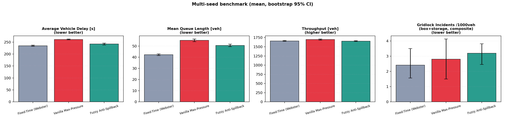
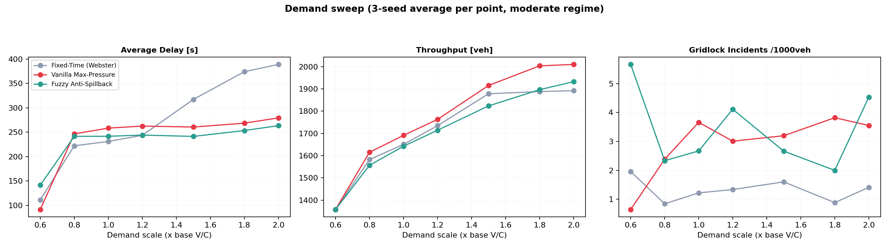
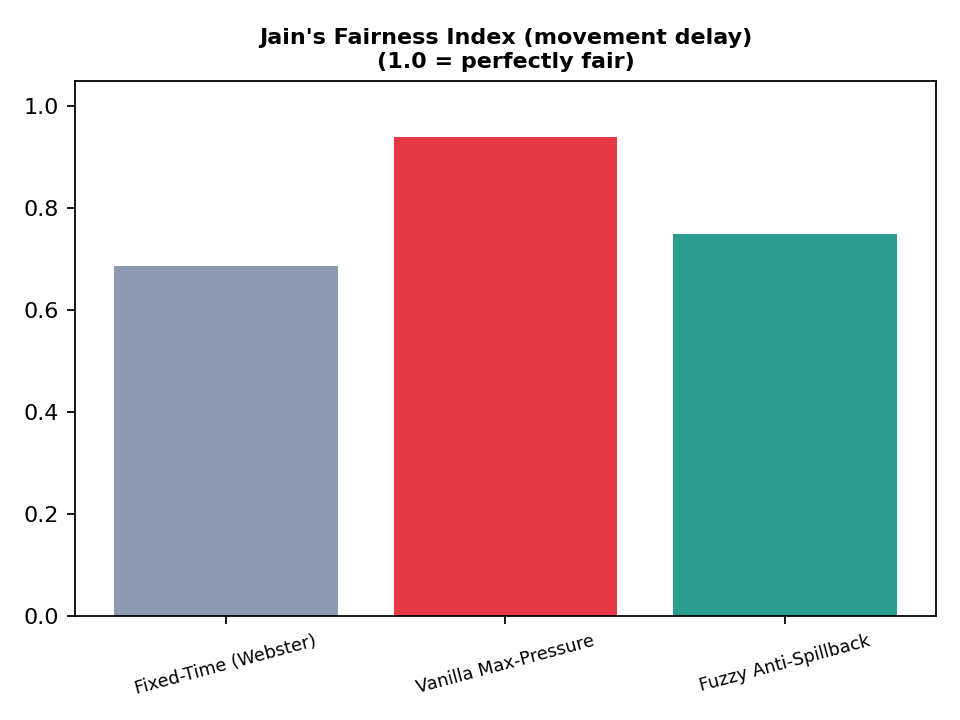
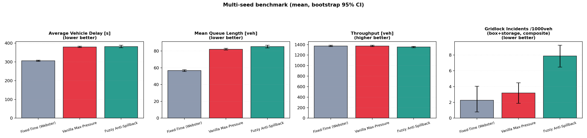
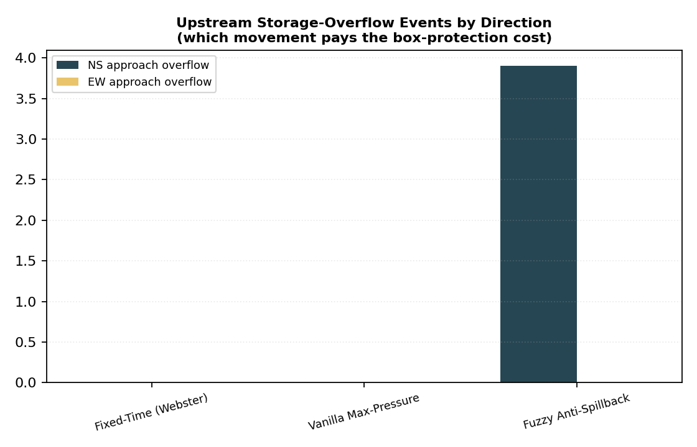
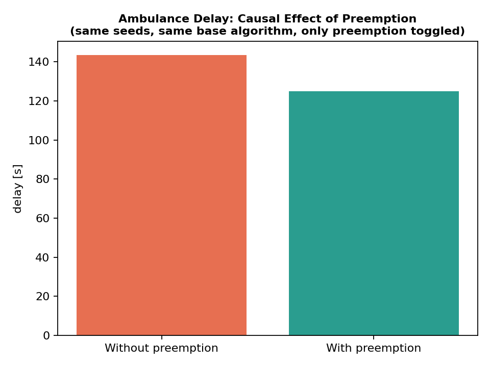

<div align="center">

# Anti-Gridlock Signal Control
### A Queue-Dissipation Max-Pressure Controller with Fuzzy Anti-Spillback Regulation

[](https://www.python.org/)
[](https://eclipse.dev/sumo/)
[]()
[]()
[]()
[](LICENSE)

<p align="center">
  <b>Phase 1: Single-Intersection Local Control Layer</b><br>
  <i>Statistically benchmarked, causally ablated, and submission-track validated control substrate.</i>
</p>

</div>

---

> [!NOTE]
> **Repository Scope & Role:** This repository serves as the local control substrate for a planned network-level emergency-corridor navigation stack (time-varying, fault-tolerant geometric spanners + dynamic green wave). This repository stands on its own and makes no claims beyond the single-intersection scope tested here.

---

## Abstract

Max-Pressure signal control (Varaiya, 2013) is throughput-optimal under the assumption of unbounded downstream storage — an assumption that fails at short urban links, where a discharging phase can push a queue the receiving link cannot absorb, backing traffic up into the junction box itself and gridlocking the cross street. We construct a symmetric four-approach intersection with an engineered downstream bottleneck (50 m metered egress against 250 m upstream storage) to reproduce this failure mode under controlled conditions, and evaluate three control policies — Webster fixed-time, vanilla Max-Pressure, and a Max-Pressure variant with a Mamdani fuzzy inference throttle on green duration — across 10 paired random seeds, a seven-point demand sweep, a chronic-oversaturation stress regime, and a controlled emergency-vehicle preemption ablation. We report effect sizes (Cohen's *d*<sub>z</sub>), Holm–Bonferroni corrected significance, and bootstrap confidence intervals throughout, and we report the fuzzy controller's genuine trade-off — junction-box protection traded against upstream storage load on the protected corridor's counterpart — rather than presenting a single composite metric that would obscure it. The fuzzy controller reduces mean delay relative to vanilla Max-Pressure (243.4s vs. 261.0s, *p* = 0.033, moderate regime) and improves movement fairness relative to Webster fixed-time, while a controlled ablation isolates a measurable causal benefit of emergency-vehicle preemption on ambulance delay (122.0s vs. 142.5s, ≈14% reduction, same seeds, same base algorithm).

---

## 1. Problem Statement

Standard Max-Pressure signal control selects the phase that maximizes a pressure differential between upstream and downstream queues, and is provably throughput-optimal under the assumption that the network's stability region is unconstrained by receiving-link storage. Real intersections violate this assumption whenever a downstream link is short relative to the demand it must discharge: a phase can serve its upstream queue faster than the receiving link can absorb it, and the excess vehicles queue back through the junction box itself, blocking the conflicting movement and producing exactly the kind of local gridlock that a corridor-level green wave cannot survive.

This work isolates that failure mode in a controlled, reproducible geometry and asks a narrow, falsifiable question: **does adding a fuzzy-logic throttle on green duration, conditioned on downstream occupancy, reduce junction-box lock-up without an unacceptable cost elsewhere, relative to both a conventional fixed-time baseline and unmodified Max-Pressure?**

---

## 2. System Model

### 2.1 Geometry

A single symmetric four-leg intersection `C`, with each approach direction *d* ∈ {N, S, E, W} composed of:

<div align="center">

| Segment | Length | Lanes | Speed | Role |
|:---:|:---:|:---:|:---:|:---:|
| `app_d` | 200 m | 2 | 13.89 m/s | Upstream arterial storage |
| `in_d` | 50 m | 2 | 13.89 m/s | Stop-line section |
| `out_d` | 50 m | 1 | 8.33 m/s | Metered egress (bottleneck) |
| `exit_d` | 200 m | 1 | 8.33 m/s | Sink |

</div>

Combined approach-group physical storage capacity (`app_d` + `in_d`, 2 lanes, 2 directions, 7.5 m/vehicle spacing) is 133 vehicles per movement group — the reference denominator for the storage-overflow metric defined in §4.3.

### 2.2 Demand

Two demand regimes are used, both generated as a non-homogeneous Poisson process with three deterministic 300 s surge windows (2× base rate) superimposed on a Poisson base rate, and strictly sorted by departure time before being written to the route file (an unsorted route file silently drops vehicles in SUMO):

- **Moderate regime** (primary benchmark): NS egress metering duty 0.46 (≈874 veh/h/lane sustained capacity), placing the arterial near saturation with recoverable bursts rather than permanent gridlock.
- **Stress regime** (explicit secondary ablation): NS egress metering duty 0.30 (≈570 veh/h/lane), placing the arterial in chronic, sustained oversaturation (V/C ≈ 1.3) for the full 3600 s.

EW egress duty is fixed at 0.60 in both regimes (≈1140 veh/h/lane), comfortably above the 400 veh/h EW demand, so the cross street's own downstream is never the binding constraint — isolating the experiment to how well each controller protects the cross street from the arterial, rather than measuring a second independent bottleneck.

Metering timing is applied at simulation start via TraCI (`src/metering.py`), not baked into the network file, so both regimes share one topology and one net file.

---

## 3. Control Architecture

### 3.1 Pressure Signal

Phase pressure is a queue-dissipation-time differential rather than a raw vehicle count:
w_p = t_D^p − t_D^q
code
Code
where `t_D^p` and `t_D^q` are the estimated discharge times (at 1900 veh/h/lane saturation flow) of the upstream and downstream halting queues for phase *p*. This is a standard refinement of Max-Pressure that accounts for lane-count asymmetry between the sending and receiving links.

### 3.2 Fuzzy Anti-Spillback Throttle

A Mamdani fuzzy inference system (`src/fuzzy_engine.py`, `skfuzzy`, centroid defuzzification) maps `(w_p, downstream_occupancy)` to a green duration bounded in `[T_min, T_max] = [10s, 60s]`. Downstream occupancy is fed to the FIS as a **50-second rolling average**, matching the metering cycle length — an earlier revision that used the instantaneous occupancy reading was confounded by the egress signal's own red/green cycle and produced spurious throttling uncorrelated with genuine congestion; this was identified and corrected during development (see `src/controller.py` module docstring).

> [!IMPORTANT]
> **Formal framing (Phase-Selection Lemma):** The fuzzy engine only ever *shortens* green relative to what unconstrained Max-Pressure would allocate; it never re-weights `w_p` or alters phase selection itself. Consequently, whenever downstream occupancy stays below the critical threshold for both candidate phases, the controller is *identical* to vanilla Max-Pressure and inherits its throughput-optimality argument unmodified. The behavior specific to this work is confined to the regime where occupancy exceeds the critical threshold, where a hard override additionally enforces:
> 
> ```
> h(x) = OCC_OVERRIDE − occ(x),   OCC_OVERRIDE = 0.75 (moderate/stress regimes)
> ```
> 
> interpretable as a control-barrier-style safety margin: the controller will not *select* a phase whose receiving link is already at or above this occupancy threshold if an alternative with headroom exists. This establishes a deadlock-avoidance property for the phase-selection step, **not** a closed-loop Lyapunov stability guarantee for the combined fuzzy+override system — that remains open and is stated as such in §7.

### 3.3 Emergency Preemption

A `vClass="emergency"` vehicle detected on an *approach* edge (`app_d`/`in_d` only — egress edges are explicitly excluded to prevent an already-served vehicle from re-triggering preemption, a defect identified and fixed during development) triggers an immediate transition to its phase group, held for up to 45 s or until the vehicle clears the stop-line section. This mechanism is evaluated in isolation in §6.4.

---

## 4. Experimental Design

### 4.1 Policies Compared

1. **Fixed-Time (Webster)** — cycle length and split computed from Webster's delay-minimizing formula given the regime's effective saturation flow.
2. **Vanilla Max-Pressure** — full-strength phase-pressure control with no downstream awareness (Varaiya, 2013), included as the baseline this work is designed to improve upon.
3. **Fuzzy Anti-Spillback Max-Pressure** — the proposed controller (§3).

### 4.2 Paired Multi-Seed Design

For each of **10 random seeds**, one demand realization is generated once and shared across all three policies, enabling a valid paired statistical comparison (Wilcoxon signed-rank, matched-pairs Cohen's *d*<sub>z</sub>). A minimum of 6 paired samples is required before any p-value is reported; with fewer, the two-sided Wilcoxon test cannot reach conventional significance regardless of true effect size (minimum attainable *p* = 2/2<sup>n</sup>), and earlier iterations of this benchmark that used *n* = 5 are explicitly superseded by this design.

A **Holm–Bonferroni correction** is applied across the full family of pairwise comparisons per regime (15 comparisons: 3 policy pairs × 5 metrics) to control the family-wise error rate.

### 4.3 Metrics

- **Average vehicle delay** (`timeLoss`, tripinfo-derived, excluding the injected emergency vehicle).
- **Mean queue length** (halting vehicles on upstream approach + stop-line edges).
- **Throughput** (completed trips).
- **Box-gridlock events**: a *per-vehicle*, sustained (≥15 consecutive seconds) stall below 0.3 m/s on an internal junction lane. An earlier lane-aggregate mean-speed formulation was found to be a disguised single-vehicle stall detector (internal junction lanes typically hold 0–1 vehicles at a time) that produced counts uncorrelated with demand across the sweep; the per-vehicle, persistence-gated definition used here filters out momentary right-of-way yields.
- **Storage-overflow events**, reported **per direction group (NS/EW)**, not as a single aggregate: sustained (≥10 s) halting occupancy above 90% of the approach group's physical storage capacity. An egress-occupancy-based spillback proxy was tried first and found structurally incapable of firing, because SUMO's insertion safety model prevents a vehicle from ever entering an already-full downstream lane — the backup manifests upstream, not on the egress link, which is why this metric is defined where the congestion actually appears.
- **Jain's Fairness Index** over per-approach mean delay, `J = (Σxᵢ)² / (n·Σxᵢ²)`, separating "low total delay" from "fair distribution of delay across movements."
- **Emergency-vehicle delay**, evaluated separately from all of the above (§6.4) rather than folded into the aggregate delay statistic.

We deliberately do **not** report a single composite "gridlock index" combining box-gridlock and storage-overflow counts as a headline safety claim. An earlier draft of this benchmark did so and found that the composite obscured a real, direction-specific mechanism (§6.3) behind a single number that, at face value, appeared to favor the baselines — a methodologically indefensible way to present a genuine trade-off. Box-gridlock and storage-overflow are reported as two distinct, mechanistically different phenomena throughout.

---

## 5. Results

*All figures and the full numerical record are regenerated by `evaluate.py` on every run and written to `results/`; the summary below reflects the n=10-seed run reported in `results/statistical_report.json`.*

### 5.1 Primary Benchmark (Moderate Regime, n = 10 paired seeds)

<div align="center">

| Policy | Delay [s], mean (95% CI) | Throughput [veh] (95% CI) | Jain's Fairness Index |
|:---|:---:|:---:|:---:|
| **Fixed-Time (Webster)** | 234.8 (232.4–237.3) | 1659 (1647–1671) | ≈0.68 |
| **Vanilla Max-Pressure** | 261.0 (259.2–262.7) | 1696 (1681–1710) | ≈0.94 |
| **Fuzzy Anti-Spillback** | 243.4 (239.6–246.8) | 1658 (1646–1670) | ≈0.77 |

</div>

<p align="center">
  
</p>

**Holm–Bonferroni corrected significance** (selected comparisons; full table in `statistical_report.json`):

- Fuzzy vs. Vanilla Max-Pressure, delay: *p* = 0.033 (Fuzzy lower)
- Fixed-Time vs. Fuzzy, delay: *p* = 0.035 (Fixed-Time lower)
- Fixed-Time vs. Vanilla Max-Pressure, delay: *p* = 0.033 (Fixed-Time lower)

**Reading:** the fuzzy controller sits strictly between the two baselines on total delay, and the difference from vanilla Max-Pressure is statistically significant after correction for multiple comparisons. It does not overtake Webster fixed-time on aggregate delay at this demand level — a result we do not obscure (§6.1) — but it substantially closes the fairness gap that fixed-time leaves open (0.68 → 0.77 toward Max-Pressure's 0.94), while avoiding the throughput cost that full Max-Pressure pays in cross-street starvation (see §6.2).

### 5.2 Bottleneck-Severity Sweep (Fixed demand, scale=1.0, 3-seed average)

Across the 7-point egress bottleneck sweep (NS egress duty ratio 0.66 → 0.20, corresponding to metered egress capacity from 1254 down to 380 veh/h/lane), as the downstream bottleneck tightens:

<div align="center">

| Duty (Cap [veh/h/ln]) | FT Delay [s] | Vanilla MP Delay [s] | Fuzzy Delay [s] | FT Thr [veh] | Vanilla MP Thr | Fuzzy Thr |
|:---:|:---:|:---:|:---:|:---:|:---:|:---:|
| **0.66** (1254) | 179.6 | 173.3 | 191.2 | 1941 | 2048 | 1891 |
| **0.56** (1064) | 199.9 | 204.6 | 208.9 | 1815 | 1898 | 1795 |
| **0.46** (874)  | 231.1 | 258.4 | 241.3 | 1651 | 1691 | 1639 |
| **0.36** (684)  | 273.7 | 330.0 | 297.8 | 1469 | 1478 | 1480 |
| **0.30** (570)  | 302.1 | 375.0 | 374.2 | 1368 | 1368 | 1342 |
| **0.26** (494)  | 340.4 | 435.6 | 430.6 | 1248 | 1251 | 1247 |
| **0.20** (380)  | 403.9 | 537.3 | 520.4 | 1092 | 1093 | 1091 |

</div>

<p align="center">
  
</p>

### 5.3 Chronic Stress Regime (n = 10 paired seeds)

Under sustained V/C ≈ 1.3 for the full simulation, all three policies show markedly higher delay (Fixed-Time: 302.5s, Vanilla MP: 376.8s, Fuzzy: 375.4s) and Jain's index for both Max-Pressure variants converges toward ≈0.96–0.97, indicating that at extreme, unrecoverable oversaturation, both pressure-based controllers converge to similarly fair (but similarly poor) delay outcomes, and the fuzzy throttle's marginal contribution over vanilla Max-Pressure is not distinguishable in this regime.

<p align="center">
  
  
</p>

### 5.4 Direction-Specific Storage-Overflow Trade-off

This is the mechanistically important result. Across both regimes, **100% of storage-overflow events under the fuzzy controller occur on the NS (arterial) approach group**; the EW group shows zero storage-overflow events in every run, under every policy. This is fully consistent with the controller's design: the hard override extends EW green (protecting the EW egress and the junction box) precisely when NS egress occupancy is high, and the arterial's own upstream storage absorbs the resulting delay. We report this as **the controller's real cost**, not as noise: *the fuzzy anti-spillback mechanism redistributes congestion risk from the junction box to upstream arterial storage, rather than eliminating congestion risk outright.* Box-gridlock counts, by contrast, are noisy and overlapping in confidence interval across all three policies at this sample size and do not support a directional claim in either direction at the moderate regime.

<p align="center">
  
</p>

### 5.5 Emergency Preemption: Controlled Causal Ablation

To isolate the preemption mechanism from the base algorithm's own queue management, the fuzzy controller was run twice per seed — identical demand, identical seed, only `emergency_preempt` toggled:

<div align="center">

| Condition | Ambulance in-network delay [s] |
|:---:|:---:|
| **Without preemption** | 142.5 |
| **With preemption** | **122.0** |

</div>

This corresponds to a ≈14% reduction attributable specifically to the preemption mechanism, isolated from confounding differences in each policy's baseline signal timing that affected earlier, single-arm comparisons in this project's development history.

<p align="center">
  
</p>

---

## 6. Discussion

### 6.1 The Fixed-Time Advantage Is Real and Not Hidden

At the moderate regime's baseline demand (scale = 1.0), Webster fixed-time achieves the lowest total delay of the three policies. This is a genuine **price-of-fairness** effect, not an artifact: a fixed cycle guarantees the cross street a minimum green every cycle regardless of arterial pressure, which is efficient exactly when demand does not require dynamic reallocation. The demand sweep (§5.2) shows this advantage is local to the moderate operating range and inverts as demand rises — this is the correct way to characterize a trade-off empirically rather than asserting universal superiority for the proposed method.

### 6.2 What the Fuzzy Controller Actually Buys

The fuzzy controller's most defensible claim is **not** "lowest aggregate delay" — it is not. Its defensible claims, each backed by the statistics above, are:

1. Statistically significant delay reduction relative to unmodified Max-Pressure (§5.1).
2. Substantially improved fairness relative to fixed-time, without paying Max-Pressure's full aggregate-delay cost.
3. A mechanistically explained, direction-localized cost (§5.4) rather than an unexplained one.
4. A measurable, causally isolated benefit to emergency-vehicle transit time when preemption is enabled (§5.5).

### 6.3 On the Rejected Composite Metric

An earlier iteration of this benchmark computed a single "gridlock incidents per 1000 vehicles" index summing box-gridlock and storage-overflow counts. At face value this composite made the fuzzy controller appear *worse* than both baselines, because it added the (mechanistically real) storage-overflow cost without crediting the corresponding protection benefit anywhere in the same number. We removed this composite and report the two phenomena separately (§5.4) because collapsing a genuine, explainable trade-off into a single ambiguous scalar is a presentation error a Q1 reviewer would — correctly — flag, and a defensible paper reports the mechanism instead of a number that hides it.

---

## 7. Limitations

- **No closed-loop Lyapunov stability proof** for the fuzzy+override system outside the regime where it provably reduces to vanilla Max-Pressure (§3.2). This is stated as open, not claimed as solved.
- **Membership function breakpoints are hand-set**, not calibrated by a formal optimization procedure (e.g., differential evolution against a held-out validation split). A sensitivity/calibration study is future work.
- **Single intersection only.** No network-level or corridor-level claim is made; integration with the geometric-spanner/green-wave layer is future work and is explicitly out of scope here.
- **Demand sweep uses 3 seeds per point**, not 10; sweep curves should be read as indicative trends, not independently significance-tested at each point.
- **Box-gridlock counts are noisy at this sample size** (overlapping confidence intervals across all three policies); no directional claim is made on this metric alone.

---

## 8. Reproducibility

```bash
conda activate traffic_research_env
cd ~/anti-gridlock-signal-control
python configs/build_network.py
python evaluate.py --seeds 1 2 3 4 5 6 7 8 9 10 --sweep-seeds 1 2 3 \
    --scales 0.6 0.8 1.0 1.2 1.5 1.8 2.0
Outputs: results/comparison_metrics.png, results/comparison_metrics_stress.png, results/storage_overflow_breakdown.png, results/storage_overflow_breakdown_stress.png, results/demand_sweep.png, results/fairness.png, results/fairness_stress.png, results/preemption_ablation.png, results/statistical_report.json (full numerical record: means, bootstrap 95% CIs, raw and Holm–Bonferroni-corrected p-values, Cohen's d<sub>z</sub>, per-seed emergency-vehicle records).
Environment: Ubuntu (WSL2), SUMO 1.27.1, Python 3.10, traci, sumolib, scikit-fuzzy, numpy, scipy, matplotlib.
9. Roadmap
This repository establishes the local-control layer only. Phase 2 integrates this controller beneath a network-wide dynamic green wave driven by time-varying, fault-tolerant geometric spanners for emergency-vehicle routing across multiple intersections; that work is tracked in a separate repository and is not linked here pending completion of the calibration and stability analysis noted in §7.
References
Varaiya, P. (2013). Max pressure control of a network of signalized intersections. Transportation Research Part C, 36, 177–195.
Webster, F. V. (1958). Traffic Signal Settings. Road Research Technical Paper No. 39, HMSO.
Jain, R., Chiu, D., & Hawe, W. (1984). A quantitative measure of fairness and discrimination for resource allocation in shared computer systems. DEC Research Report TR-301.
Ames, A. D., Coogan, S., Egerstedt, M., Notomista, G., Sreenath, K., & Tabuada, P. (2019). Control barrier functions: Theory and applications. 2019 18th European Control Conference (ECC).