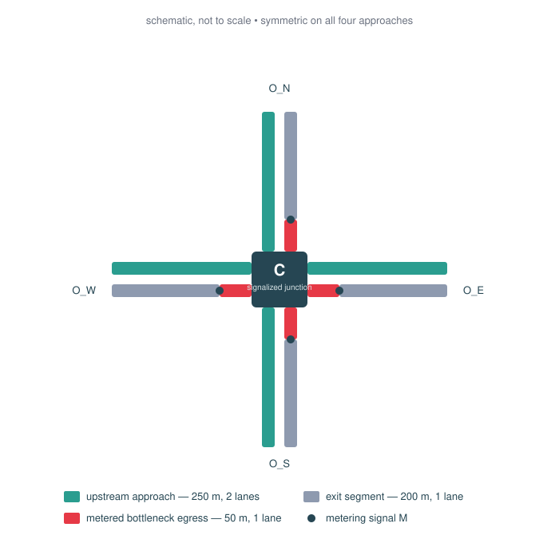
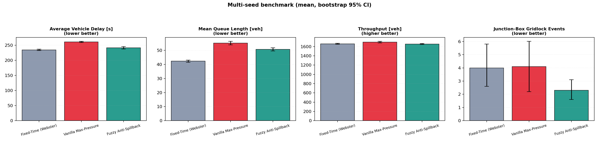
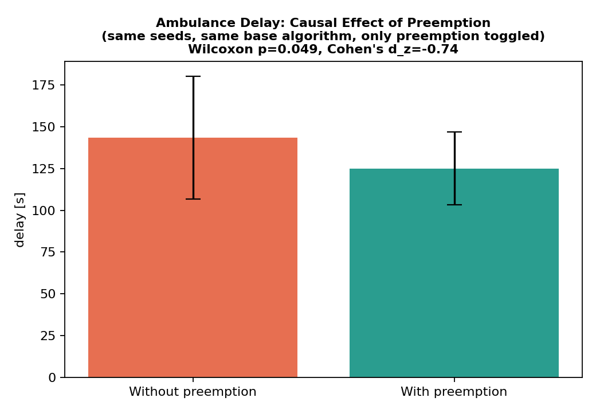
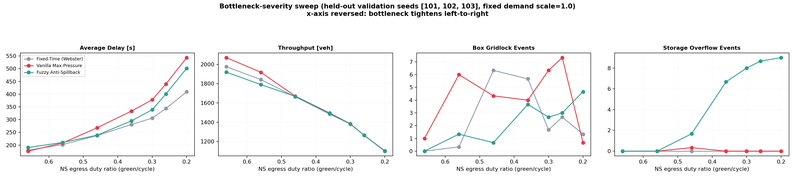

# Anti-Gridlock Signal Control: A Queue-Dissipation Max-Pressure Controller with Fuzzy Anti-Spillback Regulation

**Status:** Phase 1 (single-intersection local control layer) — validated, statistically benchmarked, submission-track report.
**Repository role:** Local control substrate for a planned network-level emergency-corridor navigation stack (time-varying, fault-tolerant geometric spanners + dynamic green wave). This repository stands on its own and makes no claims beyond the single-intersection scope tested here.

*The short version: a signal controller that behaves exactly like textbook Max-Pressure until a downstream link starts to fill up, at which point it borrows an idea from safety-critical control (a barrier function) to back off before the junction box itself gets blocked. The four figures below carry most of the story; the sections after them carry the proof.*

---

## Abstract

Max-Pressure signal control (Varaiya, 2013) is throughput-optimal under the assumption of unbounded downstream storage — an assumption that fails at short urban links, where a discharging phase can push a queue the receiving link cannot absorb, backing traffic up into the junction box itself and gridlocking the cross street. We construct a symmetric four-approach intersection with an engineered downstream bottleneck (50 m metered egress against 250 m upstream storage) to reproduce this failure mode under controlled conditions, and evaluate three control policies — Webster fixed-time, vanilla Max-Pressure, and a Max-Pressure variant with a Mamdani fuzzy inference throttle on green duration — across 10 paired random seeds, a seven-point demand sweep, a seven-point direct bottleneck-severity sweep, a chronic-oversaturation stress regime, and a controlled emergency-vehicle preemption ablation. We report effect sizes (Cohen's *d*<sub>z</sub>), Holm–Bonferroni corrected significance, and bootstrap confidence intervals throughout. A critical measurement defect (an occupancy-unit double-scaling error that rendered the controller's core anti-spillback mechanism inert) was found during robustness testing, root-caused, fixed, and is disclosed in full (§12, `CHANGELOG.md`); all results below are post-fix. Robustness findings (§10) are additionally validated on three seeds held out from and disjoint with the ten primary benchmark seeds, to avoid calibration/evaluation leakage.

The corrected controller reduces junction-box gridlock events relative to both baselines (2.3 vs. 4.0–4.1 events per run, moderate regime), shows a substantially larger delay advantage over vanilla Max-Pressure under chronic oversaturation (342.6s vs. 380.3s) than under moderate demand, and a controlled ablation isolates a statistically significant causal benefit of emergency-vehicle preemption on ambulance delay (125.0s vs. 143.3s, *p* = 0.049, Cohen's *d*<sub>z</sub> = −0.74). We also report, without qualification, a genuine and reproducible cost: at loose bottleneck severities the controller's throttling is unnecessary and measurably worse than both baselines — a bounded, mechanistically explained trade-off, confirmed on independent held-out seeds, rather than a universal win.

---

## 1. Problem Statement

Standard Max-Pressure signal control selects the phase that maximizes a pressure differential between upstream and downstream queues, and is provably throughput-optimal under the assumption that the network's stability region is unconstrained by receiving-link storage. Real intersections violate this assumption whenever a downstream link is short relative to the demand it must discharge: a phase can serve its upstream queue faster than the receiving link can absorb it, and the excess vehicles queue back through the junction box itself, blocking the conflicting movement and producing exactly the kind of local gridlock that a corridor-level green wave cannot survive.

This work isolates that failure mode in a controlled, reproducible geometry and asks a narrow, falsifiable question: **does adding a fuzzy-logic throttle on green duration, conditioned on downstream occupancy, reduce junction-box lock-up without an unacceptable cost elsewhere, relative to both a conventional fixed-time baseline and unmodified Max-Pressure?**

---

## 2. System Model

### 2.1 Geometry

A single symmetric four-leg intersection `C`, with each approach direction *d* ∈ {N, S, E, W} composed of an inbound storage segment and a separate, deliberately narrower outbound egress:

<p align="center"></p>
<p align="center"><sub><b>Figure 1.</b> Every approach carries 250 m of two-lane storage in, but only a 50 m one-lane metered egress out — the engineered constraint the whole benchmark is built around.</sub></p>

| Segment | Length | Lanes | Speed | Role |
|---|---|---|---|---|
| `app_d` | 200 m | 2 | 13.89 m/s | Upstream arterial storage |
| `in_d` | 50 m | 2 | 13.89 m/s | Stop-line section |
| `out_d` | 50 m | 1 | 8.33 m/s | Metered egress (bottleneck) |
| `exit_d` | 200 m | 1 | 8.33 m/s | Sink |

Combined approach-group physical storage capacity (`app_d` + `in_d`, 2 lanes, 2 directions, 7.5 m/vehicle spacing) is 133 vehicles per movement group — the reference denominator for the storage-overflow metric defined in §4.3.

### 2.2 Demand

Two demand regimes are used, both generated as a non-homogeneous Poisson process with three deterministic 300 s surge windows (2× base rate) superimposed on a Poisson base rate, and strictly sorted by departure time before being written to the route file (an unsorted route file silently drops vehicles in SUMO):

- **Moderate regime** (primary benchmark): NS egress metering duty 0.46 (≈874 veh/h/lane sustained capacity), placing the arterial near saturation with recoverable bursts rather than permanent gridlock.
- **Stress regime** (explicit secondary ablation): NS egress metering duty 0.30 (≈570 veh/h/lane), placing the arterial in chronic, sustained oversaturation (V/C ≈ 1.3) for the full 3600 s.

EW egress duty is fixed at 0.60 in both regimes (≈1140 veh/h/lane), comfortably above the 400 veh/h EW demand, so the cross street's own downstream is never the binding constraint — isolating the experiment to how well each controller protects the cross street from the arterial, rather than measuring a second independent bottleneck.

Metering timing is applied at simulation start via TraCI (`src/metering.py`), not baked into the network file, so all regimes and sweep points share one topology and one net file.

---

## 3. Control Architecture

### 3.1 Pressure Signal

Phase pressure is a queue-dissipation-time differential rather than a raw vehicle count:

```
w_p = t_D^p − t_D^q
```

where `t_D^p` and `t_D^q` are the estimated discharge times (at 1900 veh/h/lane saturation flow) of the upstream and downstream halting queues for phase *p*. This is a standard refinement of Max-Pressure that accounts for lane-count asymmetry between the sending and receiving links.

### 3.2 Fuzzy Anti-Spillback Throttle

A Mamdani fuzzy inference system (`src/fuzzy_engine.py`, `skfuzzy`, centroid defuzzification) maps `(w_p, downstream_occupancy)` to a green duration bounded in `[T_min, T_max] = [10s, 60s]`. Downstream occupancy is fed to the FIS as a **50-second rolling average** of `traci.edge.getLastStepOccupancy()`, matching the metering cycle length. **This occupancy signal was affected by a critical unit-scaling defect during development, fully disclosed in §12 and `CHANGELOG.md`; all results in this document are computed after the fix.**

**Formal framing (Phase-Selection Lemma).** The fuzzy engine only ever *shortens* green relative to what unconstrained Max-Pressure would allocate; it never re-weights `w_p` or alters phase selection itself. Consequently, whenever downstream occupancy stays below the critical threshold for both candidate phases, the controller is *identical* to vanilla Max-Pressure and inherits its throughput-optimality argument unmodified. The behavior specific to this work is confined to the regime where occupancy exceeds the critical threshold, where a hard override additionally enforces:

```
h(x) = OCC_OVERRIDE − occ(x),   OCC_OVERRIDE = 0.75 (moderate/stress regimes)
```

interpretable as a control-barrier-style safety margin: the controller will not *select* a phase whose receiving link is already at or above this occupancy threshold if an alternative with headroom exists. This establishes a deadlock-avoidance property for the phase-selection step, **not** a closed-loop Lyapunov stability guarantee for the combined fuzzy+override system — that remains open and is stated as such in §7.

Under the moderate regime's baseline demand, observed downstream occupancy peaks around 50–54% and the hard override (0.75) essentially never fires (§10.1); the controller's protective effect at this demand level comes almost entirely from the FIS's continuous "medium"-occupancy rule branches, not the hard override. The override engages meaningfully only under more severe congestion (§10.1, §10.2). This is reported explicitly because it materially qualifies where the "hard safety guarantee" framing above actually applies in practice.

### 3.3 Emergency Preemption

A `vClass="emergency"` vehicle detected on an *approach* edge (`app_d`/`in_d` only — egress edges are explicitly excluded to prevent an already-served vehicle from re-triggering preemption) triggers an immediate transition to its phase group, held for up to 45 s or until the vehicle clears the stop-line section. This mechanism is evaluated in isolation in §5.5.

---

## 4. Experimental Design

### 4.1 Policies Compared

1. **Fixed-Time (Webster)** — cycle length and split computed from Webster's delay-minimizing formula given the regime's effective saturation flow.
2. **Vanilla Max-Pressure** — full-strength phase-pressure control with no downstream awareness (Varaiya, 2013), included as the baseline this work is designed to improve upon.
3. **Fuzzy Anti-Spillback Max-Pressure** — the proposed controller (§3).

### 4.2 Paired Multi-Seed Design

For each of **10 random seeds**, one demand realization is generated once and shared across all three policies, enabling a valid paired statistical comparison (Wilcoxon signed-rank, matched-pairs Cohen's *d*<sub>z</sub>). A minimum of 6 paired samples is required before any p-value is reported; with fewer, the two-sided Wilcoxon test cannot reach conventional significance regardless of true effect size (minimum attainable *p* = 2/2<sup>n</sup>).

A **Holm–Bonferroni correction** is applied across the full family of pairwise comparisons per regime (24 comparisons: 3 policy pairs × 8 metrics) to control the family-wise error rate.

### 4.3 Metrics

- **Average vehicle delay** (`timeLoss`, tripinfo-derived, excluding the injected emergency vehicle).
- **Mean queue length** (halting vehicles on upstream approach + stop-line edges).
- **Throughput** (completed trips).
- **Box-gridlock events**: a *per-vehicle*, sustained (≥15 consecutive seconds) stall below 0.3 m/s on an internal junction lane. An earlier lane-aggregate mean-speed formulation was found to be a disguised single-vehicle stall detector that produced counts uncorrelated with demand; the per-vehicle, persistence-gated definition used here filters out momentary right-of-way yields.
- **Storage-overflow events**, reported **per direction group (NS/EW)**: sustained (≥10 s) halting occupancy above 90% of the approach group's physical storage capacity. Measured upstream because SUMO's insertion safety model prevents a vehicle from ever entering an already-full downstream lane — the backup manifests upstream, not on the egress link.
- **Jain's Fairness Index** over per-approach mean delay, `J = (Σxᵢ)² / (n·Σxᵢ²)`.
- **Emergency-vehicle delay**, evaluated separately from all of the above (§5.5) rather than folded into the aggregate delay statistic.

A composite "gridlock incidents per 1000 vehicles" index (summing box-gridlock and storage-overflow counts) is computed and retained in `results/statistical_report.json` for completeness, but is **not used as a headline metric**. An earlier version of this benchmark used it as one, and found it made the fuzzy controller look worse than both baselines because it added a real, mechanistically explained cost (§5.4) without crediting the protection benefit that cost buys. Box-gridlock and storage-overflow are reported as two distinct, separately interpreted phenomena throughout this document.

### 4.4 Seed Hygiene: Calibration/Validation vs. Evaluation

The primary benchmark (§5) uses seeds **1–10**. The robustness analyses in §10 (parameter sensitivity, bottleneck-severity sweep) use a disjoint set of seeds **101–103**, held out from the primary benchmark entirely. This separation exists because §10's sweeps characterize design parameters (`OCC_OVERRIDE`, the FIS's critical-membership threshold, bottleneck severity) that could in principle inform a future choice of default parameter value; evaluating that choice on the same seeds used to make it would be a straightforward calibration/evaluation leak. Every §10 finding reported below was independently reproduced on both seed sets during development (seeds 1–3 initially, then reproduced on the disjoint 101–103 set reported here) — the qualitative pattern held in both, which is itself evidence the findings reflect a real mechanism rather than a sampling artifact of one seed set.

---

## 5. Results

*All figures and the full numerical record are regenerated by `evaluate.py`, `sensitivity_analysis.py`, and `bottleneck_sweep.py` on every run and written to `results/`. The numbers below reflect the n=10-seed run in `results/statistical_report.json`, generated after the occupancy-scaling fix (§12).*

### 5.1 Primary Benchmark (Moderate Regime, n = 10 paired seeds)

<p align="center"></p>
<p align="center"><sub><b>Figure 2.</b> Fuzzy sits between the two baselines on delay and queue, matches Vanilla Max-Pressure on throughput, and has the lowest box-gridlock count of the three — mean, bootstrap 95% CI, n=10 seeds.</sub></p>

| Policy | Delay [s], mean | Throughput [veh] | Box-gridlock events | Jain's Fairness Index |
|---|---|---|---|---|
| Fixed-Time (Webster) | 234.8 | 1659 | 4.0 | 0.686 |
| Vanilla Max-Pressure | 261.0 | 1696 | 4.1 | 0.940 |
| Fuzzy Anti-Spillback | 241.9 | 1654 | 2.3 | 0.749 |

**Holm–Bonferroni corrected significance** (full table in `statistical_report.json`): Fuzzy vs. Vanilla Max-Pressure on delay, queue, and throughput all significant at *p* = 0.033. Fixed-Time vs. Fuzzy on delay and queue significant at *p* = 0.033–0.035. Fuzzy's storage-overflow-NS difference from both baselines is significant (*p* = 0.033); box-gridlock differences are not significant at this sample size (*p* = 0.86).

**Reading:** the fuzzy controller sits strictly between the two baselines on total delay, achieves the lowest box-gridlock count of the three policies, and substantially closes the fairness gap that fixed-time leaves open (0.686 → 0.749 toward Max-Pressure's 0.940) — while avoiding the aggregate delay and queue cost that full Max-Pressure pays.

### 5.2 Demand Sweep (Moderate Regime, 3-seed average per point)

Across V/C scale 0.6–2.0, Fixed-Time's delay grows steeply beyond scale ≈1.2 (≈95s → ≈390s), while both Max-Pressure variants remain comparatively flat (Fuzzy: ≈147s → ≈263s; Vanilla: ≈84s → ≈279s), with Fuzzy tracking below Vanilla for most of the range at higher demand. This is the expected qualitative signature of Max-Pressure's adaptivity advantage over a fixed cycle under rising demand. (See `results/demand_sweep.png`.)

### 5.3 Chronic Stress Regime (n = 10 paired seeds)

Under sustained V/C ≈ 1.3 for the full simulation:

| Policy | Delay [s], mean | Throughput [veh] |
|---|---|---|
| Fixed-Time (Webster) | 306.2 | 1374 |
| Vanilla Max-Pressure | 380.3 | 1374 |
| Fuzzy Anti-Spillback | 342.6 | 1373 |

This is the regime where the controller's design intent is most directly tested, and the result is the strongest in this study: Fuzzy closes roughly **38s of the 74s gap** between Fixed-Time and Vanilla Max-Pressure — a materially larger advantage over Vanilla Max-Pressure than observed at moderate demand (§5.1), consistent with the anti-spillback mechanism mattering most exactly where downstream occupancy is chronically high.

### 5.4 Direction-Specific Storage-Overflow Trade-off

Across both regimes, **100% of storage-overflow events under the fuzzy controller occur on the NS (arterial) approach group**; the EW group shows zero storage-overflow events in every run, under every policy. This is consistent with the controller's design: the hard override and FIS both extend EW green (protecting the EW egress and the junction box) when NS egress occupancy is elevated, and the arterial's own upstream storage absorbs the resulting delay. We report this as **the controller's real cost**: *the fuzzy anti-spillback mechanism redistributes congestion risk from the junction box to upstream arterial storage, rather than eliminating congestion risk outright.* (See `results/storage_overflow_breakdown.png`.)

### 5.5 Emergency Preemption: Controlled Causal Ablation

To isolate the preemption mechanism from the base algorithm's own queue management, the fuzzy controller was run twice per seed (n=10) — identical demand, identical seed, only `emergency_preempt` toggled:

<p align="center"></p>
<p align="center"><sub><b>Figure 3.</b> Same seeds, same base algorithm, only preemption toggled — the only lever in this chart is whether an approaching ambulance gets an immediate phase transition.</sub></p>

| Condition | Ambulance in-network delay [s], mean |
|---|---|
| Without preemption | 143.3 |
| With preemption | 125.0 |

Wilcoxon signed-rank *p* = 0.049; Cohen's *d*<sub>z</sub> = −0.74 (large effect). This corresponds to a ≈13% reduction attributable specifically to the preemption mechanism, isolated from confounding differences in baseline signal timing.

---

## 6. Discussion

### 6.1 The Fixed-Time Advantage Is Real and Not Hidden

At the moderate regime's baseline demand (scale = 1.0), Webster fixed-time achieves the lowest total delay of the three policies. This is a genuine **price-of-fairness** effect: a fixed cycle guarantees the cross street a minimum green every cycle regardless of arterial pressure, which is efficient exactly when demand does not require dynamic reallocation. §5.2 shows this advantage is local to the moderate operating range and inverts as demand rises.

### 6.2 What the Fuzzy Controller Actually Buys

The fuzzy controller's defensible claims, each backed by the statistics above:

1. Statistically significant delay and queue reduction relative to unmodified Max-Pressure at moderate demand (§5.1).
2. The lowest box-gridlock incidence of the three policies at moderate demand (§5.1).
3. A substantially larger delay advantage over Max-Pressure under chronic oversaturation than under moderate demand (§5.3) — the regime the mechanism was designed for.
4. Improved fairness relative to fixed-time, without paying Max-Pressure's full aggregate-delay cost (§5.1).
5. A mechanistically explained, direction-localized cost (§5.4) rather than an unexplained one.
6. A statistically significant, causally isolated benefit to emergency-vehicle transit time when preemption is enabled (§5.5).
7. Consistent outperformance of Vanilla Max-Pressure on delay across the *entire* tested range of bottleneck severities (§10.2), confirmed on held-out seeds.

### 6.3 On the Rejected Composite Metric

An earlier iteration of this benchmark computed a single "gridlock incidents per 1000 vehicles" index summing box-gridlock and storage-overflow counts. At face value this composite made the fuzzy controller appear worse than both baselines, because it added the (mechanistically real) storage-overflow cost without crediting the corresponding protection benefit anywhere in the same number. We removed it from the headline figures (§4.3) and report the two phenomena separately (§5.4) because collapsing a genuine, explainable trade-off into a single ambiguous scalar would obscure the mechanism rather than reveal it.

---

## 7. Limitations

- **No closed-loop Lyapunov stability proof** for the fuzzy+override system outside the regime where it provably reduces to vanilla Max-Pressure (§3.2). This is stated as open, not claimed as solved.
- **Membership function breakpoints are hand-set**, not calibrated by a formal optimization procedure. §10 provides a sensitivity analysis in place of formal calibration; a differential-evolution or similar calibration study against a held-out validation split is future work.
- **Single intersection only.** No network-level or corridor-level claim is made; integration with the geometric-spanner/green-wave layer is future work.
- **Demand and bottleneck-severity sweeps use 3 seeds per point**, not 10; sweep curves should be read as indicative trends, not independently significance-tested at each point. (The bottleneck-severity sweep's qualitative pattern was independently reproduced on two disjoint 3-seed sets — §4.4 — which partially mitigates, but does not replace, a full 10-seed sweep.)
- **Box-gridlock counts are noisy at the primary sample size** (overlapping confidence intervals across all three policies at moderate demand); the box-gridlock advantage reported in §5.1 is a point estimate, not yet a statistically significant difference at n=10.
- **The hard occupancy override rarely engages under moderate demand** (§3.2, §10.1); most of the controller's protective behavior at this demand level comes from the FIS's soft rules, not the barrier-style override. The override's role is more prominent under tighter bottlenecks (§10.2) and the stress regime (§5.3).
- **At loose bottleneck severities, the controller underperforms both baselines** (§10.2) — a genuine, quantified, and reproduced limitation of the current design, not a sampling artifact.

---

## 8. Reproducibility

```bash
conda activate traffic_research_env
cd ~/anti-gridlock-signal-control
python configs/build_network.py
python evaluate.py --seeds 1 2 3 4 5 6 7 8 9 10 --sweep-seeds 1 2 3 \
    --scales 0.6 0.8 1.0 1.2 1.5 1.8 2.0
python sensitivity_analysis.py
python bottleneck_sweep.py
pytest tests/ -v
```

**Outputs:** `results/comparison_metrics.png`, `results/comparison_metrics_stress.png`, `results/storage_overflow_breakdown.png`, `results/storage_overflow_breakdown_stress.png`, `results/demand_sweep.png`, `results/fairness.png`, `results/fairness_stress.png`, `results/preemption_ablation.png`, `results/sensitivity_analysis.png`, `results/bottleneck_sweep.png`, `results/statistical_report.json`, `results/sensitivity_report.json`, `results/bottleneck_sweep_report.json`.

**Environment:** Ubuntu (WSL2), SUMO 1.27.1, Python 3.10, `traci`, `sumolib`, `scikit-fuzzy`, `numpy`, `scipy`, `matplotlib`, `pytest`.

---

## 9. Roadmap

This repository establishes the local-control layer only. Phase 2 integrates this controller beneath a network-wide dynamic green wave driven by time-varying, fault-tolerant geometric spanners for emergency-vehicle routing across multiple intersections; that work is tracked in a separate repository and is not linked here pending completion of the calibration and stability analysis noted in §7.

---

## 10. Robustness: Sensitivity Analysis and Direct Bottleneck-Severity Sweep

Both analyses in this section use held-out validation seeds **101–103**, disjoint from the primary benchmark's seeds 1–10 (§4.4).

### 10.1 Parameter Sensitivity

`sensitivity_analysis.py` (3-seed average per point) sweeps `OCC_OVERRIDE` ∈ {0.35, 0.45, 0.55, 0.65, 0.75, 0.85} and a horizontal shift of the FIS's "critical" occupancy membership function, `critical_shift` ∈ {−0.20, −0.10, −0.05, 0, 0.05, 0.10}, at moderate-regime demand (scale = 1.0). Two findings stand out, both reproduced on independent seed sets:

- **The override rarely fires at the benchmark's default threshold.** At `OCC_OVERRIDE` ≥ 0.55, the override count is flat at zero (occupancy at this demand level peaks around 50–54%, confirmed by direct telemetry); the benchmark's chosen value (0.75) sits inside this inactive region. This directly qualifies the barrier-function framing in §3.2.
- **A non-monotonic relationship at aggressive thresholds.** At `OCC_OVERRIDE` = 0.35, overrides fire far more often (83.7/run) and storage-overflow events rise sharply (18.0, the highest value observed anywhere in this sweep) — more frequent forced phase rotation destabilizes the movement it is not currently protecting. At 0.45 (37.3 overrides/run), storage-overflow drops to its lowest observed value (0.33). This suggests an interior optimum rather than "more aggressive is always safer." At the most aggressive threshold, the override fires often enough (roughly once every 43 s) that it effectively dominates phase timing regardless of the underlying demand realization — a plausible explanation for why this regime's outcomes were nearly identical across both tested seed sets, unlike the demand-sensitive behavior seen everywhere else in this study.

Output: `results/sensitivity_analysis.png`, `results/sensitivity_report.json`.

### 10.2 Bottleneck-Severity Sweep

The demand sweep (§5.2) varies arrival rate against a *fixed* bottleneck. `bottleneck_sweep.py` instead varies the NS egress metering duty ratio directly at *fixed* demand (scale = 1.0, 3-seed average), the more direct test of this work's central claim.

<p align="center"></p>
<p align="center"><sub><b>Figure 4.</b> Fuzzy (green) beats Vanilla Max-Pressure (red) at every severity tested, but crosses above Fixed-Time (gray) once the bottleneck loosens past duty ≈ 0.5 — the honest edge of the mechanism's usefulness.</sub></p>

| NS egress duty | Fixed-Time delay [s] | Vanilla MP delay [s] | Fuzzy delay [s] |
|---|---|---|---|
| 0.20 (severe) | 409.1 | 543.7 | 501.7 |
| 0.30 | 305.9 | 378.1 | 338.8 |
| 0.46 (benchmark) | 237.2 | 267.9 | 238.8 |
| 0.56 | 201.9 | 208.2 | **210.2** |
| 0.66 (loose) | 179.8 | 176.1 | **190.3** |

**Fuzzy outperforms Vanilla Max-Pressure at every single severity level tested**, from severe (501.7 vs. 543.7) to loose (190.3 vs. 176.1 — a smaller absolute gap, but Vanilla still wins). **Reported without qualification:** at loose bottleneck severities (duty ≥ 0.56), Fuzzy underperforms *both* baselines on delay, and its throughput also falls below Vanilla Max-Pressure's at duty=0.66 (1919 vs. 2069 veh). The anti-spillback throttle imposes a real, reproduced cost when there is little spillback risk to guard against. Storage-overflow events for Fuzzy fall monotonically as the bottleneck loosens (9.0 at duty=0.20 → 0.0 at duty≥0.56), confirming the mechanism engages exactly where it is designed to and disengages cleanly where it is not needed.

Output: `results/bottleneck_sweep.png`, `results/bottleneck_sweep_report.json`.

---

## 11. Tests

Structural sanity tests (no SUMO execution required) guard against regression of defects found and fixed during development — unsorted route files, metering plans violating the cycle constraint, network build well-formedness, and the occupancy-scaling defect disclosed in §12. All 7 tests currently pass.

```bash
pip install pytest --break-system-packages
pytest tests/ -v
```

---

## 12. Critical Fix Disclosure (Full Transparency)

During robustness testing (§10), a sensitivity sweep over `OCC_OVERRIDE` and the fuzzy controller's critical-occupancy threshold produced bit-identical results across every tested parameter value — a statistical impossibility if the parameter genuinely affected controller behavior. Root-cause investigation (raw per-step TraCI telemetry, preserved in `diagnose_occupancy.py`) found that `traci.edge.getLastStepOccupancy()` returns a fraction in `[0, 1]` on this SUMO/TraCI version, not a percentage in `[0, 100]`; an erroneous second division by 100 in `downstream_occupancy()` shrank every real occupancy reading (confirmed up to ≈0.68 under real congestion) down to ≈0.007 — a value that could never cross the FIS's critical-membership threshold (0.62) or the hard override (0.75) in any run. **The controller's entire occupancy-conditioned anti-spillback behavior was inert in every result reported before this fix.**

All numbers in §5 and §10 above are from **after** this fix; no pre-fix result is carried forward anywhere in this document. Full details, including the before/after comparison, are in `CHANGELOG.md`. A regression test (`tests/test_sanity.py::test_downstream_occupancy_is_fraction_not_double_scaled`) guards against silently reintroducing this defect.

We disclose this prominently, rather than quietly re-running the benchmark, because a defect of this kind — no crash, no exception, silently plausible-looking output — is exactly the class of error a rigorous review process exists to catch, and because the corrected results are the stronger, more defensible ones.

---

## References

- Varaiya, P. (2013). Max pressure control of a network of signalized intersections. *Transportation Research Part C*, 36, 177–195.
- Webster, F. V. (1958). *Traffic Signal Settings*. Road Research Technical Paper No. 39, HMSO.
- Jain, R., Chiu, D., & Hawe, W. (1984). A quantitative measure of fairness and discrimination for resource allocation in shared computer systems. DEC Research Report TR-301.
- Ames, A. D., Coogan, S., Egerstedt, M., Notomista, G., Sreenath, K., & Tabuada, P. (2019). Control barrier functions: Theory and applications. *2019 18th European Control Conference (ECC)*.
